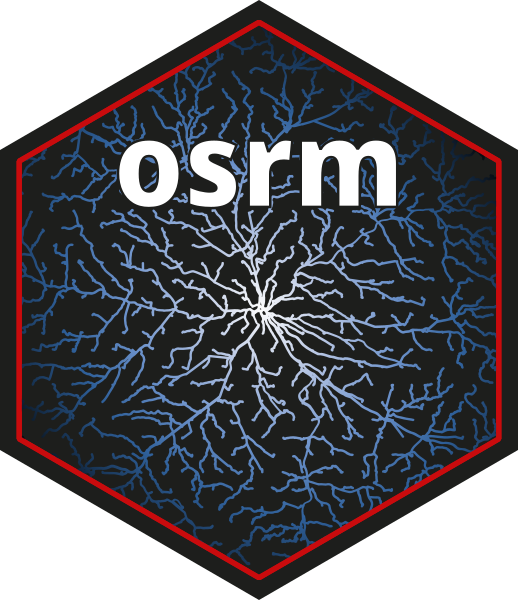
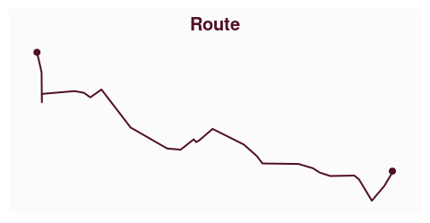
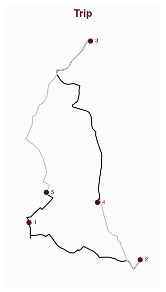
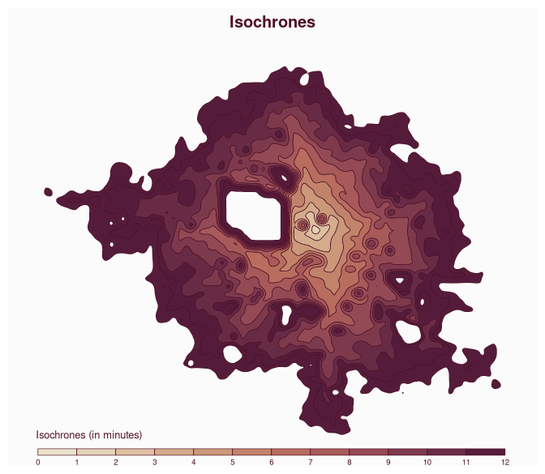

# osrm 

[](https://cran.r-project.org/package=osrm)
[](https://riatelab.r-universe.dev/osrm)

[](https://cran.r-project.org/package=osrm)
[](https://doi.org/10.21105/joss.04574)

***Interface between R and the OpenStreetMap-based routing service
[OSRM](https://project-osrm.org/)***

## Description

OSRM is a routing service based on OpenStreetMap data. See
<https://project-osrm.org/> for more information. This package enables
the computation of routes, trips, isochrones and travel distances
matrices (travel time and kilometric distance) with R.

This package relies on the usage of a running OSRM service (tested with
v26.10.0 of OSRM).

You can run your own instance of OSRM following guidelines provided
[here](https://github.com/Project-OSRM/osrm-backend). A simple solution
is to use [docker
containers](https://github.com/Project-OSRM/osrm-backend#using-docker)
and you can find and exemple of building a European-wide OSRM Server
[here](https://rcarto.github.io/posts/build_osrm_server/).\
Alternatively, you can use
[`osrm.backend`](https://www.ekotov.pro/osrm.backend/), an R package
that installs and controls OSRM executables to prepare routing data and
run/stop a local server.

⚠ **You must be careful using the OSRM demo server and read the [*about*
page](https://routing.openstreetmap.de/about.html) of the service**:

> [One request per second max. No scraping, no heavy
> usage.](https://routing.openstreetmap.de/about.html)

## Features

- `osrmTable()` uses the *table* service to query time/distance
  matrices,
- `osrmRoute()` uses the *route* service to query routes,
- `osrmTrip()` uses the *trip* service to query trips,
- `osrmNearest()` uses the *nearest* service to query the nearest
  point(s) on the street network,
- `osrmIsochrone()` and `osrmIsodistance()` use multiple `osrmTable()`
  calls to create isochrones or isodistances polygons.

## Demo

This is a short overview of the main features of `osrm`. The dataset
used here is shipped with the package, it is a sample of 100 random
pharmacies in Berlin ([© OpenStreetMap
contributors](https://www.openstreetmap.org/copyright/en)) stored in a
[geopackage](https://www.geopackage.org/) file.

### Time / distance matrices

`osrmTable()` gives access to the *table* OSRM service. In this example
we use this function to get the median time needed to access any
pharmacy from any other pharmacy.

``` r
library(osrm)
library(sf)
library(mapsf)
pharmacy <- sf::st_read(system.file("gpkg/apotheke.gpkg", package = "osrm"), quiet = TRUE)
travel_time <- osrmTable(loc = pharmacy)
travel_time$durations[1:5, 1:5]
```

    ##      1    2    3    4    5
    ## 1  0.0 21.9 34.5 20.1 10.3
    ## 2 22.5  0.0 43.2 16.5 20.5
    ## 3 34.2 43.5  0.0 31.0 27.9
    ## 4 19.6 17.1 30.1  0.0 12.8
    ## 5  9.5 20.7 27.6 12.7  0.0

``` r
median(travel_time$durations)
```

    ## [1] 21.6

The median time needed to access any pharmacy from any other pharmacy is
21.6 minutes.

### Routes

`osrmRoute()` is used to compute the shortest route between two points.
Here we compute the shortest route between the two first pharmacies.

``` r
(route <- osrmRoute(src = pharmacy[1, ], dst = pharmacy[2, ]))
```

    ## Simple feature collection with 1 feature and 4 fields
    ## Geometry type: LINESTRING
    ## Dimension:     XY
    ## Bounding box:  xmin: -13170.51 ymin: 5837172 xmax: -3875.06 ymax: 5841047
    ## Projected CRS: WGS 84 / UTM zone 34N
    ##     src dst duration distance                       geometry
    ## 1_2   1   2     21.9   12.838 LINESTRING (-13170.51 58410...

This route is 12.838 kilometers long and it takes 21.9 minutes to drive
through it.

``` r
mf_map(route, lwd = 2)
mf_map(pharmacy[1:2, ], pch = 20, cex = 1.5, add = TRUE)
mf_title("Route")
```

<!-- -->

### Travelling salesman problem

`osrmTrip()` can be used to resolve the travelling salesman problem, it
gives the shortest trip between a set of unordered points. In this
example we want to obtain the shortest trip between the first five
pharmacies.

``` r
(trips <- osrmTrip(loc = pharmacy[1:5, ], overview = "full"))
```

    ## [[1]]
    ## [[1]]$trip
    ## Simple feature collection with 5 features and 4 fields
    ## Geometry type: LINESTRING
    ## Dimension:     XY
    ## Bounding box:  xmin: -13431.44 ymin: 5837172 xmax: -3875.322 ymax: 5856333
    ## Projected CRS: WGS 84 / UTM zone 34N
    ##   start end duration distance                       geometry
    ## 1     1   2     21.9   12.838 LINESTRING (-13170.77 58410...
    ## 2     2   4     16.5    8.450 LINESTRING (-3875.322 58379...
    ## 3     4   3     30.1   18.169 LINESTRING (-7444.513 58427...
    ## 4     3   5     27.9   16.447 LINESTRING (-8024.73 585621...
    ## 5     5   1      9.5    4.229 LINESTRING (-11716.82 58435...
    ## 
    ## [[1]]$summary
    ## [[1]]$summary$duration
    ## [1] 105.9
    ## 
    ## [[1]]$summary$distance
    ## [1] 60.133
    ## 
    ## 
    ## [[1]]$waypoints
    ## Simple feature collection with 5 features and 2 fields
    ## Geometry type: POINT
    ## Dimension:     XY
    ## Bounding box:  xmin: -13170.77 ymin: 5837935 xmax: -3875.322 ymax: 5856219
    ## Projected CRS: WGS 84 / UTM zone 34N
    ##   id snapping_distance                  geometry
    ## 1  1             0.003 POINT (-13170.77 5841047)
    ## 2  2             0.018 POINT (-3875.322 5837935)
    ## 4  4             0.027 POINT (-7444.513 5842729)
    ## 3  3             0.014  POINT (-8024.73 5856219)
    ## 5  5             0.007 POINT (-11716.82 5843569)

The shortest trip between these pharmacies takes 105.9 minutes and is
60.133 kilometers long. The steps of the trip are described in the
“trip” sf object (point 1 \> point 2 \> point 4 \> point 3 \> point 5 \>
point 1).

``` r
trip <- trips[[1]]$trip
waypoints <- trips[[1]]$waypoints

# Display the trip
mf_map(trip, col = c("black", "grey"), lwd = 2)
mf_map(waypoints, cex = 1.5, pch = 21, add = TRUE)
mf_label(waypoints, var = "id", pos = 4, add = TRUE)
mf_title("Trip")
```

<!-- -->

### Point(s) on the street network

`osrmNearest()` returns the nearest point(s) on the street network from
any point. Here we will get the nearest point on the network from a
couple of coordinates.

``` r
pt_not_on_street_network <- c(13.40, 52.47)
(pt_on_street_network <- osrmNearest(loc = pt_not_on_street_network))
```

    ## Simple feature collection with 1 feature and 2 fields
    ## Geometry type: POINT
    ## Dimension:     XY
    ## Bounding box:  xmin: 13.39671 ymin: 52.46661 xmax: 13.39671 ymax: 52.46661
    ## Geodetic CRS:  WGS 84
    ##    id distance                  geometry
    ## 1 loc    0.439 POINT (13.39671 52.46661)

The distance from the input point to the nearest point on the street
network is of 0.439 kilometers.

### Isochrones

`osrmIsochrone()` computes areas that are reachable within a given time
span from a point and returns the reachable regions as polygons. These
areas of equal travel time are called isochrones. Here we compute the
isochrones from a specific point defined by its longitude and latitude.
Please note that in this example, we are using a local instance of the
OSRM server to obtain very detailed isochrones (n = 20000).

``` r
iso <- osrmIsochrone(
  loc = c(13.43, 52.47),
  breaks = seq(0, 12, 1),
  n = 20000, smooth = TRUE,
  osrm.server = "http://0.0.0.0:5000/"
)
mf_map(iso, "isomax", "choro",
  breaks = unique(c(iso$isomin, iso$isomax)),
  leg_title = "Isochrones (in minutes)", leg_horiz = TRUE,
  leg_pos = "bottom", leg_val_rnd = 0
)
mf_title("Isochrones")
```

<!-- -->

## Installation

You can install the released version of `osrm` from
[CRAN](https://CRAN.R-project.org/package=osrm) with:

``` r
install.packages("osrm")
```

Alternatively, you can install the development version of `osrm` from
[r-universe](https://riatelab.r-universe.dev/osrm) with:

``` r
install.packages('osrm', repos = c('https://riatelab.r-universe.dev', 'https://cloud.r-project.org'))
```

## Community Guidelines

One can contribute to the package through [pull
requests](https://codeberg.org/riatelab/osrm/pulls) and report issues or
ask questions [here](https://codeberg.org/riatelab/osrm/issues). See the
[CONTRIBUTING.md](https://codeberg.org/riatelab/osrm/src/branch/master/CONTRIBUTING.md)
file for detailed instructions.

## Acknowledgements

Many thanks to the editor and reviewers of the [JOSS
article](https://doi.org/10.21105/joss.04574).\
This publication has led to a significant improvement in the code base
and documentation of the package.
